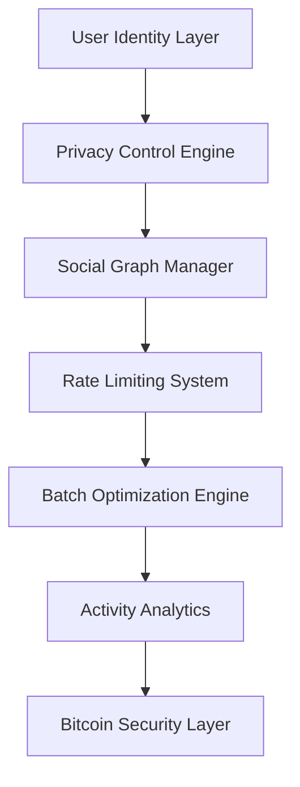
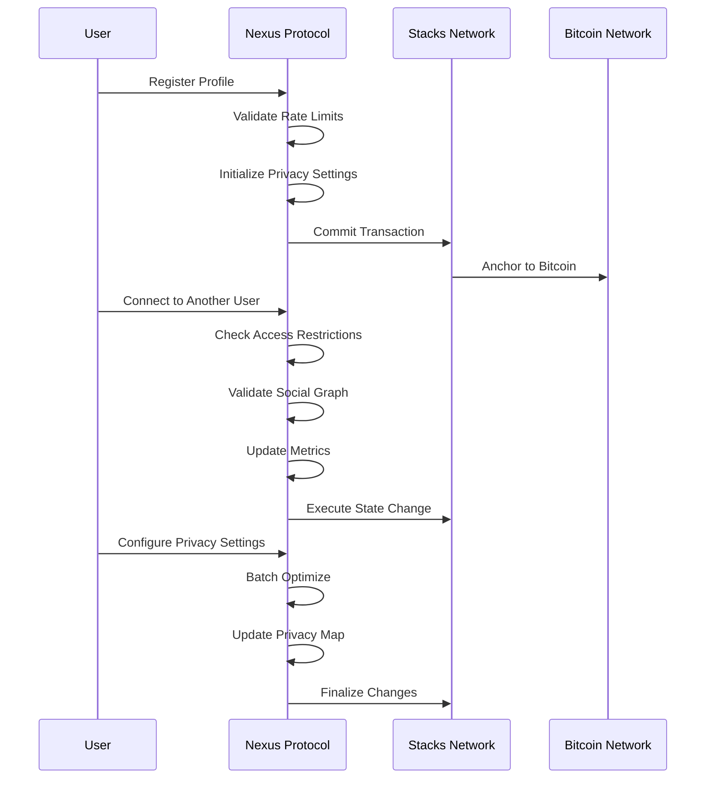

# Nexus Protocol

## Next-Generation Decentralized Social Infrastructure

[](LICENSE)
[](https://stacks.co)
[](https://bitcoin.org)

A Bitcoin-secured social networking protocol that revolutionizes digital relationships through cryptographic privacy, reputation scoring, and community-driven governance on the Stacks blockchain.

## 🌟 Features

- **🔐 Cryptographic Identity Sovereignty** - Bitcoin-backed security guarantees
- **🕵️ Zero-Knowledge Privacy Controls** - Selective data sharing with granular permissions
- **📊 Dynamic Reputation Scoring** - Community trust metrics and social proof
- **⚡ Intelligent Batch Processing** - Adaptive optimization for network efficiency
- **🤝 Comprehensive Relationship Management** - Social graph integrity and connection controls
- **🛡️ Sybil Attack Resistance** - Advanced rate-limiting mechanisms

## 🏗️ System Overview

Nexus Protocol empowers users with sovereign control over their digital social identity. Built on Bitcoin's immutable foundation via Stacks Layer 2, it delivers enterprise-grade privacy controls, sophisticated relationship dynamics, and intelligent resource optimization while maintaining Bitcoin-level security guarantees.

### Core Components



## 🏛️ Contract Architecture

The Nexus Protocol consists of a single, comprehensive smart contract organized into modular components:

### Data Structure Layer

- **UserProfiles** - Primary identity management with metadata
- **PrivacySettings** - Granular visibility and encryption controls  
- **SocialConnections** - Bidirectional relationship state tracking
- **UsageMetrics** - Rate limiting and abuse prevention analytics
- **BatchSessions** - Performance optimization tracking
- **UserMetrics** - Engagement and activity analytics
- **AccessRestrictions** - User blocking and access control

### Business Logic Layer

- **Identity Management** - User registration and profile operations
- **Privacy Engine** - Zero-knowledge data sharing controls
- **Social Graph** - Connection management and relationship tracking
- **Rate Limiting** - Sybil attack prevention and resource protection
- **Batch Processing** - Adaptive performance optimization
- **Activity Tracking** - User engagement and analytics

### Security Layer

- **Access Control** - Principal-based permission validation
- **Rate Limiting** - Multi-dimensional usage tracking
- **Input Validation** - Parameter sanitization and bounds checking
- **State Consistency** - Atomic operations and data integrity

## 📊 Data Flow



## 🚀 Getting Started

### Prerequisites

- [Clarinet](https://github.com/hirosystems/clarinet) - Stacks development tool
- [Node.js](https://nodejs.org/) v16+ - For testing and development
- [Stacks CLI](https://docs.stacks.co/docs/command-line-interface) - Blockchain interaction

### Installation

1. **Clone the repository**

```bash
git clone https://github.com/emeka-favour/nexus-protocol.git
cd nexus-protocol
```

2. **Install dependencies**

```bash
npm install
```

3. **Verify contract syntax**

```bash
clarinet check
```

4. **Run the test suite**

```bash
npm test
```

### Development Setup

1. **Start local Stacks node**

```bash
clarinet integrate
```

2. **Deploy to local testnet**

```bash
clarinet deploy --testnet
```

3. **Run contract analysis**

```bash
clarinet analyze
```

## 📋 Contract Interface

### Core Functions

#### Identity Management

- `update-profile-data()` - Update user profile information
- `authenticate-session()` - Track user presence and activity

#### Privacy Controls

- `configure-privacy-settings()` - Set granular visibility permissions
- `resolve-privacy-settings()` - Retrieve privacy configuration

#### Performance Optimization  

- `optimize-batch-performance()` - Adaptive batch size tuning
- `configure-batch-size()` - Manual performance configuration

#### Utility Functions

- `validate-rate-limit()` - Check usage quotas
- `validate-social-connection()` - Verify user relationships
- `validate-active-account()` - Confirm account status

### Error Codes

| Code | Constant | Description |
|------|----------|-------------|
| 100 | `ERR_USER_NOT_FOUND` | User profile does not exist |
| 101 | `ERR_RESOURCE_EXISTS` | Resource already exists |
| 102 | `ERR_ACCESS_DENIED` | Insufficient permissions |
| 103 | `ERR_INVALID_PARAMETERS` | Invalid function parameters |
| 104 | `ERR_USER_BLOCKED` | User access restricted |
| 105 | `ERR_ACCOUNT_INACTIVE` | Account not active |
| 106 | `ERR_RATE_LIMIT_EXCEEDED` | Usage quota exceeded |
| 107 | `ERR_BATCH_CAPACITY_FULL` | Batch processing full |
| 108 | `ERR_BATCH_SESSION_EXPIRED` | Batch session timeout |

## 🔧 Configuration

### Rate Limiting Parameters

- **Daily Action Limit**: 100 operations per 24-hour cycle
- **Connection Requests**: 20 per day maximum
- **Profile Updates**: 24 per day maximum
- **Rate Reset Interval**: 86,400 blocks (~24 hours)

### Batch Processing

- **Minimum Batch Size**: 10 operations
- **Maximum Batch Size**: 100 operations  
- **Batch TTL**: 3,600 blocks (~1 hour)
- **Adaptive Optimization**: Dynamic sizing based on usage patterns

### Account Status States

- `STATUS_INACTIVE` (0) - Newly created or deactivated account
- `STATUS_ACTIVE` (1) - Fully operational account
- `STATUS_SUSPENDED` (2) - Temporarily restricted account

### Relationship States

- `RELATION_PENDING` (0) - Connection request sent
- `RELATION_CONNECTED` (1) - Active social connection
- `RELATION_BLOCKED` (2) - User blocked relationship

## 🧪 Testing

The protocol includes comprehensive test coverage for all major components:

```bash
# Run full test suite
npm test

# Run specific test categories  
npm run test:integration
npm run test:unit
npm run test:security

# Check contract with Clarinet
clarinet check

# Generate test coverage report
npm run test:coverage
```

## 🔒 Security Considerations

### Rate Limiting Protection

- Multi-dimensional usage tracking prevents abuse
- Automatic cycle reset maintains fair access
- Operation-specific quotas prevent resource exhaustion

### Access Control

- Principal-based authentication for all operations
- Granular privacy settings with default-secure configuration
- User blocking capabilities for harassment prevention

### Data Integrity

- Immutable audit trails for all social interactions
- Atomic operations prevent inconsistent states
- Input validation prevents malformed data injection

## 📖 Documentation

- [Contract Specification](docs/CONTRACT.md) - Detailed technical documentation
- [API Reference](docs/API.md) - Complete function reference
- [Privacy Guide](docs/PRIVACY.md) - Privacy features and controls
- [Developer Guide](docs/DEVELOPMENT.md) - Integration instructions

## 🤝 Contributing

We welcome contributions to Nexus Protocol! Please see our [Contributing Guidelines](CONTRIBUTING.md) for details.

### Development Process

1. Fork the repository
2. Create a feature branch (`git checkout -b feature/amazing-feature`)
3. Commit your changes (`git commit -m 'Add some amazing feature'`)
4. Push to the branch (`git push origin feature/amazing-feature`)
5. Open a Pull Request

### Code Standards

- Follow Clarity best practices and conventions
- Include comprehensive tests for new features
- Update documentation for public API changes
- Ensure all security checks pass

## 📄 License

This project is licensed under the MIT License - see the [LICENSE](LICENSE) file for details.

## 🙏 Acknowledgments

- Stacks Foundation for blockchain infrastructure
- Bitcoin Core for security foundation
- Clarity language development team
- Open source community contributors
